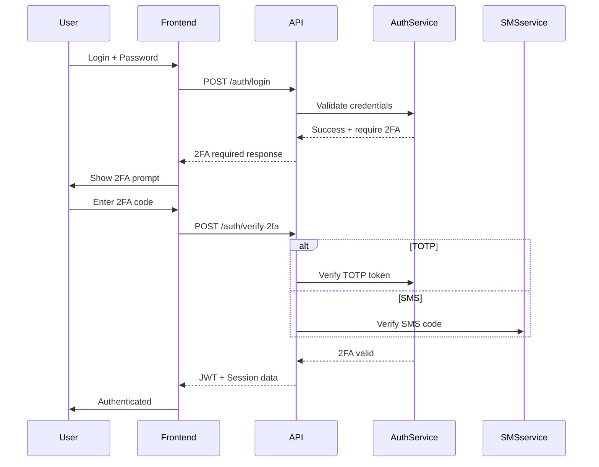
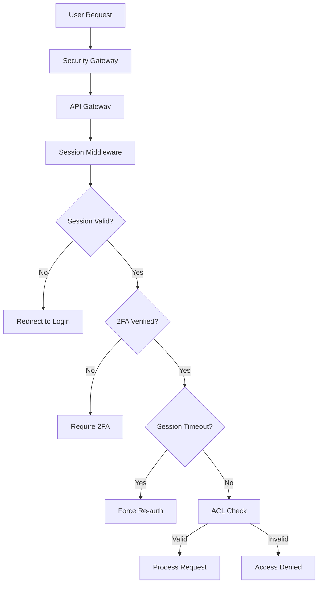

# Архитектура Выделенного B2B-Портала с Повышенной Безопасностью

## Обзор Архитектуры

### Основные Принципы
- **Изолированная Среда**: Технически независимый модуль с выделенной инфраструктурой
- **Безопасность "Банк-Клиент"**: Многоуровневая система защиты и контроля доступа
- **Производительность**: Оптимизация для работы с большими объемами данных
- **Персонализация**: Адаптация под корпоративный брендинг

### Архитектурные Слои

```
┌─────────────────────────────────────────────────────────────┐
│                    Выделенный B2B Портал                    │
├─────────────────────────────────────────────────────────────┤
│  Frontend Layer (Next.js)                                   │
│  ├── Персонализированный интерфейс                         │
│  ├── Динамическая брендинговая тема                        │
│  └── Изолированное приложение (/b2b-portal)                │
├─────────────────────────────────────────────────────────────┤
│  Security Gateway Layer                                    │
│  ├── WAF (Web Application Firewall)                        │
│  ├── Rate Limiting & DDoS Protection                       │
│  ├── SSL/TLS Termination                                   │
│  └── IP Whitelisting                                       │
├─────────────────────────────────────────────────────────────┤
│  API Gateway + Auth Layer                                  │
│  ├── Enhanced B2B Auth Middleware                          │
│  ├── 2FA Validation Service                                │
│  ├── Session Management with Redis                         │
│  └── API Rate Limiting                                     │
├─────────────────────────────────────────────────────────────┤
│  Application Services Layer                                │
│  ├── Enhanced B2B Company Service                          │
│  ├── 2FA Service (SMS/TOTP)                                │
│  ├── Audit Logging Service                                 │
│  ├── Encryption Service                                    │
│  ├── Session Security Service                              │
│  └── Access Control List (ACL) Service                     │
├─────────────────────────────────────────────────────────────┤
│  Enhanced Database Layer                                   │
│  ├── PostgreSQL (Encrypted Columns)                        │
│  ├── Redis (Sessions + Cache)                              │
│  └── Audit Log Database (Immutable Records)               │
├─────────────────────────────────────────────────────────────┤
│  Infrastructure Layer                                      │
│  ├── Docker Swarm/Kubernetes Cluster                       │
│  ├── Dedicated Monitoring                                  │
│  ├── Security Monitoring (SIEM)                           │
│  └── Backup & Recovery                                     │
└─────────────────────────────────────────────────────────────┘
```

## Ключевые Компоненты Безопасности

### 1. Двухфакторная Аутентификация (2FA)
- **TOTP (Time-based OTP)**: Через приложения аутентификаторы
- **SMS 2FA**: Для резервного канала
- **Обязательная 2FA**: Для администраторов и критических операций

### 2. Управление Сессиями
- **Автоматический тайм-аут**: 10-15 минут бездействия
- **Secure Session Cookies**: HttpOnly, Secure, SameSite
- **Session Hijacking Protection**: IP и User-Agent проверка

### 3. Расширенная ACL-модель
- **Гибкие роли**: Настраиваемые права доступа
- **Иерархические разрешения**: Наследование прав
- **Feature Gates**: Доступ по подписке

### 4. Шифрование и Защита Данных
- **End-to-End Encryption**: TLS 1.3 для всех соединений
- **At-Rest Encryption**: AES-256 для критических данных
- **PII Data Masking**: Маскирование персональных данных

### 5. Журнал Аудита
- **Неизменяемые записи**: Append-only логи
- **Подробные события**: Кто, Когда, Что, IP, Device
- **Real-time Monitoring**: Мгновенные оповещения

## Технологический Стек

### Backend Enhanced
```typescript
// Дополнительные пакеты безопасности
npm install speakeasy qrcode crypto-node sms-service
npm install argon2 uuid helmet express-rate-limit
npm install audit-log encryption-service redis-session
```

### Frontend Portal
```typescript
// Выделенное B2B приложение
/app/b2b-portal/
├── [company]/          // Персонализированные страницы
├── auth/              // Аутентификация с 2FA
├── dashboard/         // Безопасная панель управления
├── employees/         // Управление сотрудниками
├── tickets/           // Корпоративные билеты
└── settings/          // Настройки безопасности
```

## Расширенные Роли

### Enhanced Role System
```typescript
export enum B2BUserRole {
  SUPER_ADMIN = 'super_admin',
  COMPANY_ADMIN = 'company_admin',
  DEPARTMENT_MANAGER = 'department_manager',
  ACCOUNTANT = 'accountant',          // Новая роль
  BOOKING_AGENT = 'booking_agent',    // Новая роль
  EMPLOYEE = 'employee',
  CAPTAIN = 'captain'
}

// Система разрешений
export interface Permission {
  resource: string;
  action: string;
  conditions?: string[];
}

export const ROLE_PERMISSIONS = {
  [B2BUserRole.ACCOUNTANT]: [
    'balance:view',
    'transactions:view',
    'reports:export'
  ],
  [B2BUserRole.BOOKING_AGENT]: [
    'tickets:create',
    'tickets:view',
    'routes:search'
  ],
  [B2BUserRole.COMPANY_ADMIN]: [
    'employees:*',
    'deposit:replenish',
    'billing:view',
    'audit:view'
  ]
};
```

## Схемы Безопасности

### 1. Two-Factor Authentication Flow


### 2. Session Security Architecture


### 3. Audit Logging System
```typescript
interface AuditEvent {
  id: string;
  timestamp: Date;
  userId: string;
  companyId: string;
  action: string;
  resource: string;
  resourceType: string;
  ipAddress: string;
  userAgent: string;
  sessionId: string;
  result: 'SUCCESS' | 'FAILURE';
  details: Record<string, any>;
  riskScore: number;
}

// Примеры аудируемых событий
AUDIT_EVENTS = {
  'LOGIN_SUCCESS': { risk: 10 },
  'LOGIN_FAILURE': { risk: 25 },
  '2FA_FAILURE': { risk: 40 },
  'ROLE_CHANGE': { risk: 50 },
  'EMPLOYEE_DELETE': { risk: 30 },
  'TICKET_CREATE': { risk: 5 },
  'DEPOSIT_REPLENISH': { risk: 20 },
  'EXPORT_REPORT': { risk: 15 }
};
```

## Маршрутизация Безопасности

### Изолированные маршруты B2B портала
```typescript
// /api/b2b-portal/* - выделенные endpoints с повышенной безопасностью
/api/b2b-portal/auth/login          // Enhanced auth with 2FA
/api/b2b-portal/auth/verify-2fa     // 2FA verification
/api/b2b-portal/auth/session        // Session management
/api/b2bportal/companies/:id/audit  // Audit log access
/api/b2b-portal/users/:id/roles     // Role management
/api/b2b-portal/deposit/replenish   // Financial operations
/api/b2b-portal/reports/export      // Secure data export
```

## Метрики Безопасности

### KPI для мониторинга безопасности
- **Authentication Success Rate**: >95%
- **2FA Adoption Rate**: 100% for admins
- **Session Security Score**: >90%
- **Audit Log Coverage**: 100% critical actions
- **Failed Login Rate**: <5% (DDoS protection)
- **Response Time**: <200ms for auth operations

### Оповещения безопасности
- Множественные неудачные попытки входа
- Подозрительные IP адреса
- Изменения ролей администраторов
- Крупные финансовые операции
- Экспорт чувствительных данных

## Compliance

### Соответствие стандартам
- **PCI DSS**: Для обработки платежей
- **GDPR**: Защита персональных данных EU
- **ISO 27001**: Information Security Management
- **SOC 2 Type II**: Security controls reporting
- **Central Bank Standards**: "Банк-Клиент" требования

Эта архитектура обеспечивает промышленный уровень безопасности для B2B портала с возможностью масштабирования и адаптации под корпоративные требования.